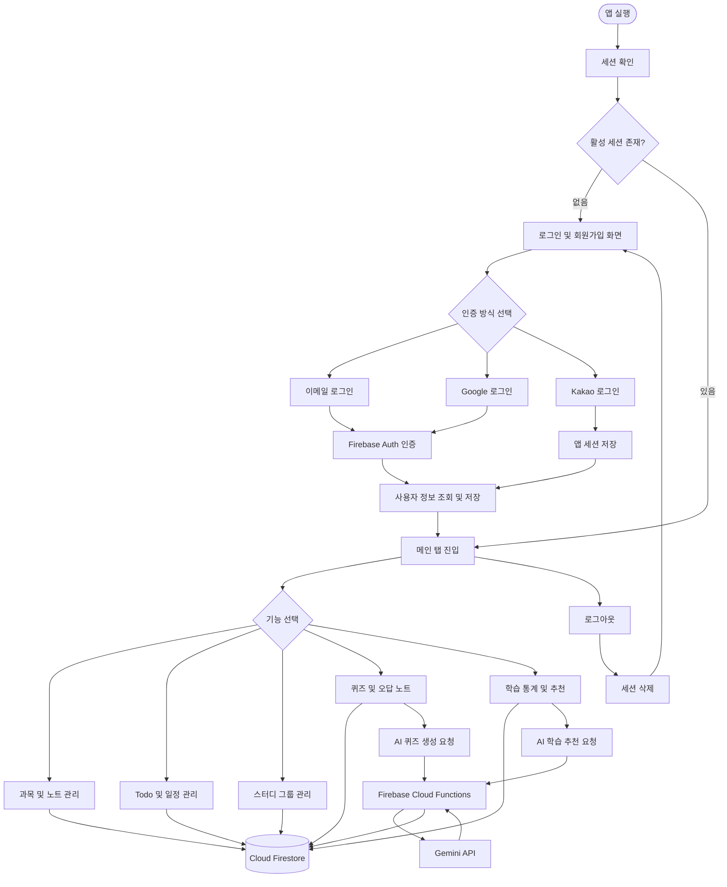
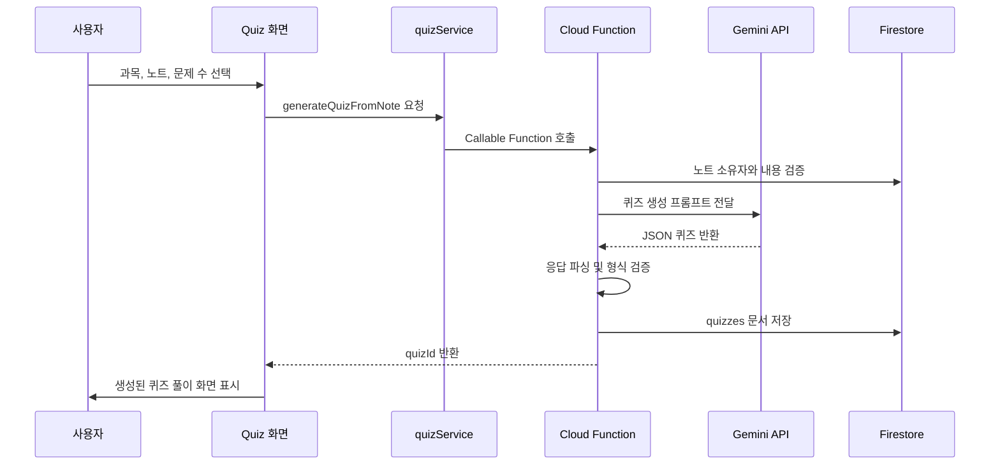

# Plandy

Plandy는 과목, 할 일, 일정, 학습 노트와 스터디 그룹을 한곳에서 관리하고, 노트를 기반으로 AI 퀴즈와 학습 우선순위를 제공하는 학습 관리 애플리케이션입니다.

Expo와 React Native로 Web/Android/iOS 화면을 함께 구성하며, Firebase Authentication, Firestore, Cloud Functions를 백엔드로 사용합니다. AI 기능은 Firebase Cloud Functions에서 Gemini API를 호출해 제공합니다.

## 주요 기술

| 영역 | 기술 |
| --- | --- |
| 클라이언트 | React 19, React Native 0.81, Expo 54, Expo Router |
| 인증 | Firebase Authentication, Google Sign-In, Kakao OAuth |
| 데이터베이스 | Cloud Firestore |
| 서버 | Firebase Cloud Functions v2, Node.js 24 |
| AI | Gemini API (`gemini-2.5-flash` 기본값) |
| 테스트 | Jest, Jest Expo, Node Test Runner |
| 배포 | EAS Build, Firebase Hosting/Functions |

## 구현 기능

### 계정 및 인증

- 이메일 회원가입 및 이메일/아이디 로그인
- Google, Kakao 소셜 로그인
- 사용자 프로필 표시 및 로그아웃
- 이메일, Google, Kakao 계정 재인증 후 회원 탈퇴
- 로그아웃 상태와 보호 화면 접근을 관리하는 세션 라우팅

### 학습 관리

- 과목 등록, 목표 수정, 삭제
- 과목별 노트 작성, 조회, 수정, 삭제
- 과목별 노트 수와 Todo 완료율을 이용한 진척도 표시
- Todo 등록, 수정, 삭제, 완료/미완료 전환
- Todo 과목, 유형, 마감일, 우선순위, 설명 관리
- 전체/완료/미완료 Todo 필터

### 일정 및 스터디

- 개인 일정 등록, 수정, 삭제
- 일정 날짜/시간 및 D-day 표시
- 로컬 알림 권한 요청과 일정 리마인더 예약
- 스터디 그룹 생성 및 초대 코드 참여
- 그룹원별 가능 시간 등록
- 겹치는 가능 시간을 바탕으로 스터디 시간 추천
- 추천 시간을 개인/그룹 일정으로 등록

### 퀴즈 및 추천

- 과목과 노트를 선택해 AI 객관식 퀴즈 생성
- 문제 수 선택: 5, 10, 15, 20, 25, 30문제
- 퀴즈 풀이, 채점, 결과 저장
- 최근 풀이 결과를 기준으로 오답 노트 제공
- 과목별 학습량, Todo 완료율, 누적 완료 추이 시각화
- 미완료 Todo와 퀴즈 정답률을 반영한 AI 학습 우선순위 추천

## 실행 가이드

### 1. 사전 준비

- Node.js와 npm
- Firebase 프로젝트
- Web 실행: 최신 브라우저
- Android 실행: Android Studio/에뮬레이터 또는 Expo 개발 빌드
- Cloud Functions 실행/배포: Node.js 24 및 Firebase CLI

Google 네이티브 로그인은 커스텀 네이티브 모듈을 사용하므로 Expo Go가 아닌 개발 빌드가 필요합니다.

### 2. 앱 의존성 설치

```bash
cd plandy-app
npm install
```

### 3. 환경 변수 설정

`plandy-app/.env` 파일을 만들고 Firebase 및 OAuth 값을 입력합니다.

```dotenv
EXPO_PUBLIC_FIREBASE_API_KEY=
EXPO_PUBLIC_FIREBASE_AUTH_DOMAIN=
EXPO_PUBLIC_FIREBASE_PROJECT_ID=
EXPO_PUBLIC_FIREBASE_STORAGE_BUCKET=
EXPO_PUBLIC_FIREBASE_MESSAGING_SENDER_ID=
EXPO_PUBLIC_FIREBASE_APP_ID=

EXPO_PUBLIC_GOOGLE_WEB_CLIENT_ID=
EXPO_PUBLIC_GOOGLE_IOS_CLIENT_ID=
EXPO_PUBLIC_KAKAO_REST_API_KEY=
```

Android 네이티브 빌드에는 Firebase에서 내려받은 `google-services.json`을 `plandy-app/`에 배치해야 합니다. CI에서는 `GOOGLE_SERVICES_JSON` 환경 변수로 경로를 지정할 수 있습니다.

Kakao 로그인 콜백 주소는 현재 `https://se-plandy-app.vercel.app/kakao-auth.html`로 설정되어 있습니다. 다른 도메인에 배포할 경우 `plandy-app/src/authService.js`의 `KAKAO_REDIRECT_URI`와 Kakao Developers의 Redirect URI를 함께 변경해야 합니다.

### 4. 앱 실행

```bash
# Expo 개발 서버
npm start

# Web
npm run web

# Android
npm run android

# iOS
npm run ios
```

### 5. Cloud Functions 설정 및 실행

```bash
cd plandy-app

# Gemini API 키를 Firebase Secret으로 등록
firebase functions:secrets:set GEMINI_API_KEY

# Functions 의존성 설치
cd functions
npm install

# Functions 에뮬레이터 실행
npm run serve
```

Gemini 모델을 변경하려면 Functions 실행 환경에 `GEMINI_MODEL`을 설정합니다. 설정하지 않으면 `gemini-2.5-flash`를 사용합니다.

### 6. 테스트 및 검사

```bash
cd plandy-app

# 앱 서비스 및 순수 유틸리티 테스트
npm test

# 유틸리티 테스트 커버리지
npm run test:coverage

# Expo ESLint
npm run lint

# Cloud Functions 테스트
cd functions
npm test
```

테스트 범위의 상세 설명은 [`plandy-app/TEST_GUIDE.md`](plandy-app/TEST_GUIDE.md)를 참고합니다.

### 7. 빌드 및 배포

```bash
cd plandy-app

# Expo Web 정적 파일 생성
npx expo export --platform web

# Firebase Hosting 및 Functions 배포
firebase deploy --only hosting,functions

# EAS Android 개발 APK 빌드
npx eas build --profile development --platform android
```

`plandy-app/eas.json`에는 development, preview, production 빌드 프로필이 정의되어 있습니다.

## 코드 흐름도

### 전체 애플리케이션 흐름



### AI 퀴즈 생성 흐름



## 데이터 구조

| Firestore 컬렉션 | 역할 |
| --- | --- |
| `users` | 사용자 프로필 및 로그인 제공자 정보 |
| `usernames` | 로그인 아이디와 이메일/UID 매핑 |
| `subjects` | 사용자 과목, 목표, 진척도 |
| `todos` | 과목별 Todo, 마감일, 우선순위, 완료 상태 |
| `schedules` | 개인 및 스터디 일정 |
| `notes` | 과목별 학습 노트 |
| `study_groups` | 그룹원, 초대 코드, 가능 시간, 그룹 일정 |
| `quizzes` | AI 생성 또는 저장된 퀴즈와 문제 목록 |
| `quiz_results` | 사용자별 점수, 정답률, 오답 목록 |

대부분의 사용자 데이터는 `user_id` 필드로 소유자를 구분합니다. 스터디 그룹은 `members` 배열과 `host_id`를 사용합니다.

## 프로젝트 구조

```text
se-plandy-team7/
├─ README.md                    # 프로젝트 통합 문서
├─ package.json                 # 루트 정적 콜백 파일 빌드 스크립트
├─ public/
│  └─ kakao-auth.html           # Kakao OAuth Web 콜백
└─ plandy-app/
   ├─ app/                      # Expo Router 화면과 라우트
   │  ├─ (tabs)/                # 로그인 후 표시되는 메인 탭
   │  ├─ quiz/                  # 퀴즈 생성 및 풀이 화면
   │  └─ incorrect-note/        # 오답 노트 상세 화면
   ├─ src/                      # Firebase 설정, 세션, 도메인 서비스
   │  └─ utils/                 # 계산/검증 중심 순수 함수
   ├─ components/               # 공통 UI 컴포넌트
   ├─ constants/                # 공통 테마
   ├─ hooks/                    # 테마 관련 React Hook
   ├─ functions/                # Firebase Cloud Functions
   ├─ __tests__/                # 앱 서비스/유틸리티 Jest 테스트
   ├─ assets/                   # 앱 아이콘과 이미지
   ├─ app.config.js             # 환경 변수를 지원하는 Expo 설정
   ├─ firebase.json             # Hosting/Functions 배포 설정
   ├─ eas.json                  # EAS Build 프로필
   └─ TEST_GUIDE.md             # 테스트 범위 및 실행 안내
```

## 주요 파일 역할

### 화면 및 라우팅

| 파일 | 역할 |
| --- | --- |
| `plandy-app/app/_layout.tsx` | 루트 Stack과 인증 기반 보호 라우팅 |
| `plandy-app/app/index.tsx` | 로그인, 회원가입, 소셜 로그인, 회원 탈퇴 |
| `plandy-app/app/(tabs)/_layout.tsx` | 인증 후 탭 메뉴와 공통 사용자 헤더 |
| `plandy-app/app/(tabs)/subjects.tsx` | 과목 CRUD와 과목별 진척도 요약 |
| `plandy-app/app/subject-notes.tsx` | 선택한 과목의 노트 CRUD |
| `plandy-app/app/note-detail.tsx` | 노트 내용 상세 조회 |
| `plandy-app/app/(tabs)/todo.tsx` | Todo CRUD, 필터, 캘린더 입력 |
| `plandy-app/app/(tabs)/schedule.tsx` | 일정 CRUD와 로컬 알림 리마인더 |
| `plandy-app/app/(tabs)/studyGroup.tsx` | 스터디 그룹, 가능 시간, 추천 일정 관리 |
| `plandy-app/app/(tabs)/quiz.tsx` | 과목별 퀴즈 목록, 생성 진입, 오답 노트 목록 |
| `plandy-app/app/quiz/generate.tsx` | AI 퀴즈 생성 요청과 로딩/오류 처리 |
| `plandy-app/app/quiz/[quizId].tsx` | 퀴즈 풀이, 채점, 결과 저장 |
| `plandy-app/app/incorrect-note/[resultId].tsx` | 퀴즈 결과별 오답 상세 |
| `plandy-app/app/(tabs)/recommendation.tsx` | AI 추천과 학습 통계 차트 |
| `plandy-app/app/kakao-auth.tsx` | 네이티브 Kakao OAuth 딥링크 콜백 |

### 서비스 및 공통 로직

| 파일 | 역할 |
| --- | --- |
| `plandy-app/src/firebase.js` | Firebase App, Auth, Firestore, Functions 초기화 |
| `plandy-app/src/appSession.js` | Firebase/Kakao 공통 세션과 로그아웃 상태 관리 |
| `plandy-app/src/authService.js` | 이메일, Google, Kakao 인증 처리 |
| `plandy-app/src/accountService.js` | 재인증, 사용자 데이터 정리, 회원 탈퇴 |
| `plandy-app/src/userService.js` | 사용자 프로필 조회 및 형식 통일 |
| `plandy-app/src/subjectService.js` | 과목 CRUD |
| `plandy-app/src/todoService.js` | Todo 검증, CRUD, 정렬 |
| `plandy-app/src/progressService.js` | 과목별 학습량과 완료율 계산 |
| `plandy-app/src/quizService.js` | 퀴즈/결과/오답 조회와 Cloud Function 호출 |
| `plandy-app/src/utils/*.js` | 날짜, 검증, 정렬, 학습/추천/퀴즈 계산용 순수 함수 |

### UI, 서버 및 설정

| 파일 | 역할 |
| --- | --- |
| `plandy-app/components/UserHeaderRight.tsx` | 사용자 프로필과 로그아웃 버튼 |
| `plandy-app/components/SubjectDropdown.tsx` | 재사용 가능한 과목 선택 모달 |
| `plandy-app/constants/theme.ts` | 색상과 폰트 테마 |
| `plandy-app/functions/index.js` | AI 학습 추천과 AI 퀴즈 생성 Callable Functions |
| `plandy-app/functions/quizUtils.js` | Gemini 퀴즈 프롬프트, 파싱, 검증 |
| `plandy-app/app.config.js` | Android Google 설정과 Expo 플러그인 구성 |
| `plandy-app/firebase.json` | Functions 소스 및 Hosting rewrite 설정 |
| `public/kakao-auth.html` | Web Kakao 로그인 결과를 앱 창/딥링크로 전달 |

## 테스트 구조

- `plandy-app/__tests__/`: 계정, 과목, Todo, 퀴즈 서비스와 `src/utils` 단위 테스트
- `plandy-app/functions/quizUtils.test.js`: 서버 측 퀴즈 파싱/검증 테스트
- Firebase, Expo Router, 실제 OAuth 및 Firestore 통합 동작은 단위 테스트 범위에서 제외

## 참고 사항

- `.env`, `google-services.json`, Firebase Secret은 Git에 커밋하지 않습니다.
- Kakao 사용자는 Firebase Auth 사용자가 아닌 앱 세션 사용자로 동작할 수 있어 `appSession.js`가 세션을 함께 관리합니다.
- 회원 탈퇴 시 사용자 소유 문서와 스터디 그룹 참여 정보를 정리한 뒤 인증 계정을 삭제합니다.
- `components/` 일부 파일은 Expo 기본 템플릿 컴포넌트이며 현재 핵심 기능에서 직접 사용되지 않을 수 있습니다.

---

## 협업 가이드

### 1. 커밋 메시지 형식

커밋 메시지는 아래 형식을 따른다.

```text
타입: 작업 내용
```

예시:

```text
feat: 로그인 기능 구현
fix: 퀴즈 저장 오류 수정
docs: README 수정
```

### 2. 커밋 타입

- `feat`: 새로운 기능 추가
- `fix`: 버그 수정
- `docs`: 문서 작성 또는 수정
- `style`: 코드 포맷 또는 UI 스타일 수정
- `refactor`: 코드 구조 개선
- `test`: 테스트 코드 작성 또는 수정
- `chore`: 설정, 패키지, 기타 작업

### 3. 커밋 규칙

- 커밋 메시지는 한글로 작성한다.
- 하나의 커밋에는 하나의 작업만 포함한다.
- 작업 내용을 짧고 명확하게 작성한다.
- 실행되지 않는 코드는 커밋하지 않는다.
- `.env`, 비밀번호, API Key 등 민감한 정보는 커밋하지 않는다.
- 커밋 전 변경 파일을 확인한다.

```bash
git status
```

### 4. 브랜치 전략

#### 브랜치 구조

```text
main
develop
feature/*
fix/*
docs/*
```

#### 브랜치 설명

- `main`: 최종 제출용 안정 버전
- `develop`: 개발 기능을 통합하는 브랜치
- `feature/*`: 새로운 기능 개발
- `fix/*`: 버그 수정
- `docs/*`: 문서 작업

### 5. 브랜치 규칙

- `main` 브랜치에는 직접 커밋하지 않는다.
- 모든 기능 개발은 `develop` 브랜치에서 새 브랜치를 만들어 진행한다.
- 작업 완료 후 Pull Request를 생성해 `develop` 브랜치로 병합한다.
- 기능 통합 후 정상 실행되면 `develop` 브랜치를 `main` 브랜치로 병합한다.
- Pull Request는 최소 1명 이상 확인 후 병합한다.

### 6. 브랜치 이름 예시

```text
feature/login
feature/quiz

fix/login-error
fix/quiz-save-error

docs/readme
docs/final-report
```

### 7. 작업 흐름

#### 1. develop 최신화

```bash
git checkout develop
git pull origin develop
```

#### 2. 작업 브랜치 생성

```bash
git checkout -b feature/login
```

#### 3. 커밋

```bash
git add .
git commit -m "feat: 로그인 기능 구현"
```

#### 4. 원격 브랜치에 push

```bash
git push origin feature/login
```

#### 5. Pull Request 생성

```text
feature/login → develop
```

### 8. Pull Request 규칙

- PR 제목은 작업 내용을 간단히 작성한다.
- PR은 `develop` 브랜치로 보낸다.
- 병합 전 실행 여부를 확인한다.

예시:

```text
[FEAT] 로그인 기능 구현
[FIX] 퀴즈 저장 오류 수정
[DOCS] README 수정
```

### 9. 협업 시 주의사항

- 작업 시작 전 항상 `develop` 최신 코드를 받는다.
- 같은 파일을 여러 명이 동시에 수정하지 않도록 작업 범위를 나눈다.
- 큰 기능은 작은 단위로 나누어 커밋한다.
- 병합 후 사용하지 않는 브랜치는 삭제한다.
- 최종 제출 전에는 `main` 브랜치가 정상 실행되는지 확인한다.
